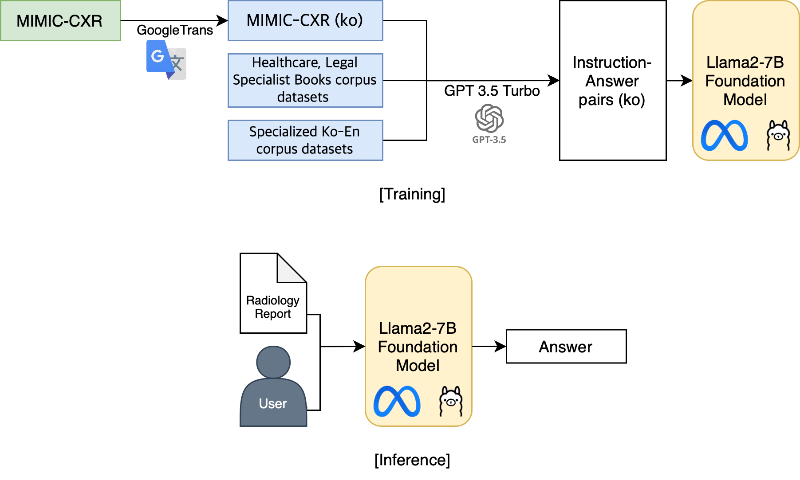
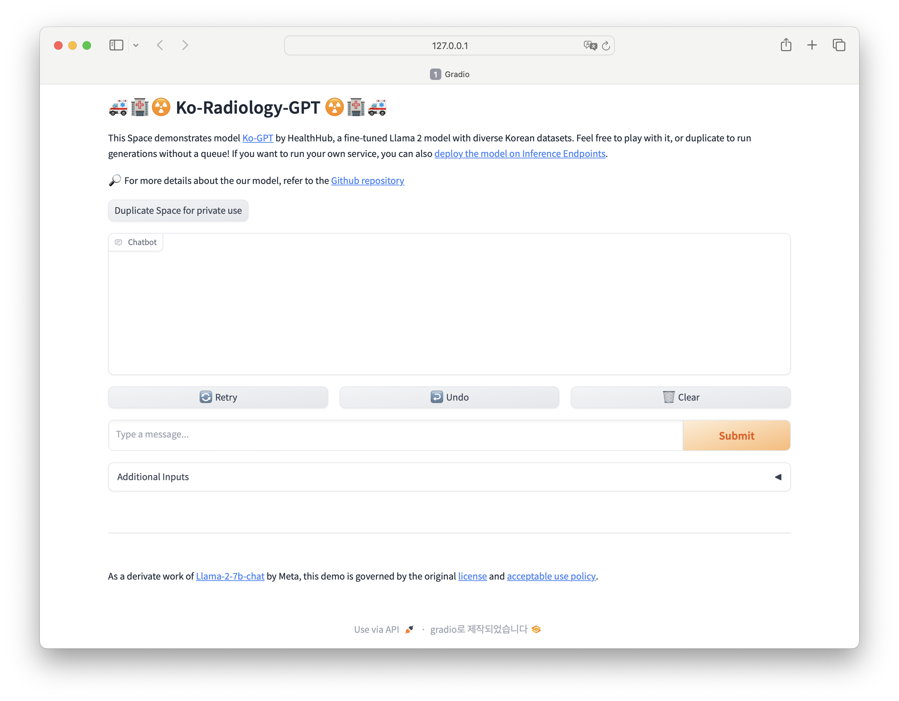
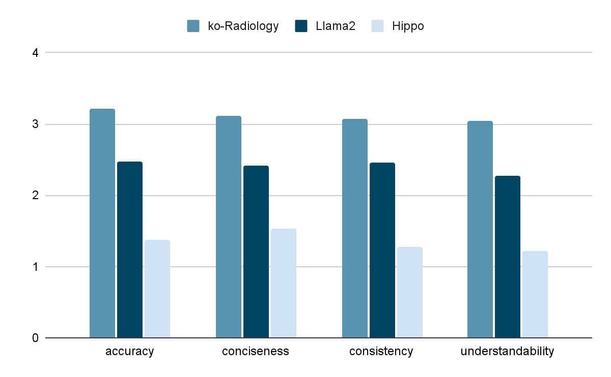

## Objective  
The goal of this project is to develop **Radiology-GPT**, a Korean language model designed for real-time question-answering based on chest X-ray reports. Radiology-GPT is tailored to help non-experts, such as patients, understand complex radiology findings through interactive Q&A in Korean. The model is expected to enhance accessibility to radiology information and support efficient healthcare communication.

 

## Data Collection and Preprocessing
Data sources included:
1. **MIMIC-CXR**: A large-scale dataset containing chest X-ray images and corresponding radiology reports in English. Since no comprehensive Korean radiology report dataset was available, we used Google Translate to convert MIMIC-CXR reports into Korean.
2. **AI Hub**: Korean medical datasets from AI Hub, including Korean-English medical corpora and specialized medical text corpora, were used to supplement the translated data. Around 4,000 samples focused on radiology and related medical terms were selected for this project.

 

## Data Preprocessing
involved several steps:
- **Data Translation**: MIMIC-CXR reports were translated into Korean, focusing on preserving medical accuracy. For consistency, extraneous formatting and line breaks were removed prior to translation.
- **QA Pair Generation**: Using GPT-3.5-turbo, we created question-answer pairs for various tasks (e.g., summarization, paraphrasing, acronym expansion). Questions were generated to represent typical inquiries users might have about X-ray reports, and answers were generated to provide clear, medically accurate responses.
- **Data Structuring**: The QA pairs were then formatted as JSONL files, suitable for training.

 

## Model and Training Approach
The model used for fine-tuning was **Llama2-7B-chat**, chosen for its conversational abilities and efficiency. Given the computational constraints, **Low-Rank Adaptation (LoRA)** and **8-bit quantization** were applied to reduce memory usage and make the model suitable for local deployment.

- **LoRA**: This technique updates only a small, decomposed part of the model parameters, significantly reducing memory requirements.
- **8-bit Quantization**: This converts the model’s parameters from 32-bit to 8-bit, further optimizing memory usage without sacrificing performance.

  

 

## Implementation
- The fine-tuning process was conducted using PyTorch and Hugging Face’s Transformers library, leveraging Google Colab’s A100 GPU.
- We integrated **Gradio** for building a user-friendly interface, allowing real-time Q&A on radiology reports.

  

 

## Key Features
Radiology-GPT can handle multiple tasks related to radiology report interpretation:
1. **Summarization**: Providing concise summaries of complex radiology reports.
2. **Information Extraction**: Extracting specific information from reports.
3. **Paraphrasing**: Rephrasing medical content to make it more understandable.
4. **Acronym Expansion**: Explaining technical abbreviations for easier comprehension.

 

## Results
Radiology-GPT’s performance was evaluated on four main criteria: **accuracy**, **conciseness**, **consistency**, and **understandability**. The model achieved high scores across these metrics, significantly outperforming baseline models like the unmodified Llama2 and the existing English-based Hippo model in all categories, especially in Q&A and summarization tasks. Radiology-GPT recorded an average accuracy score of 3.21/4.

  

 

## Challenges and Future Directions 
Although Radiology-GPT successfully meets its primary objectives, some limitations remain. Currently, users need to re-upload the radiology report for each question, which can be improved. Future iterations will focus on making the model retain context across questions, further optimizing it for continuous conversations. Additionally, exploring other Korean medical datasets and refining the model with enhanced evaluation metrics will be prioritized to further boost its usability and reliability.

 

## My Role in the Radiology-GPT Project

In the Radiology-GPT project, my responsibilities covered a range of key tasks, from data preparation to user experience:

1. **Data Collection**: I secured additional Korean-language medical data from sources like AI Hub, including specialized Korean-English corpora and medical text corpora. This was essential for fine-tuning the model to provide accurate and relevant responses in Korean.

2. **QA Generation**: Using the collected data, I generated question-answer pairs that covered typical inquiries a user might have about radiology reports. This step was crucial to preparing the model to handle various tasks, including summarization, information extraction, and paraphrasing.

3. **Evaluation Design**: Together with the team, I defined the evaluation metrics—accuracy, conciseness, consistency, and understandability—to assess the model's performance comprehensively. I also assisted in drafting the prompts that would guide the model's evaluation, ensuring that the responses met our high standards for quality and usability.

4. **Testing and Analysis**: I actively participated in evaluating Radiology-GPT’s performance, analyzing its responses across different tasks and comparing them to baseline models. My analysis contributed to identifying areas of improvement, ensuring that the model effectively supports non-expert users in understanding radiology reports.

5. **User Manual and Demo Creation**: I developed the user manual and demo interface to make Radiology-GPT accessible and user-friendly. This included designing a conversational UI that allows users to interact with the model intuitively, enhancing its practical usability.
