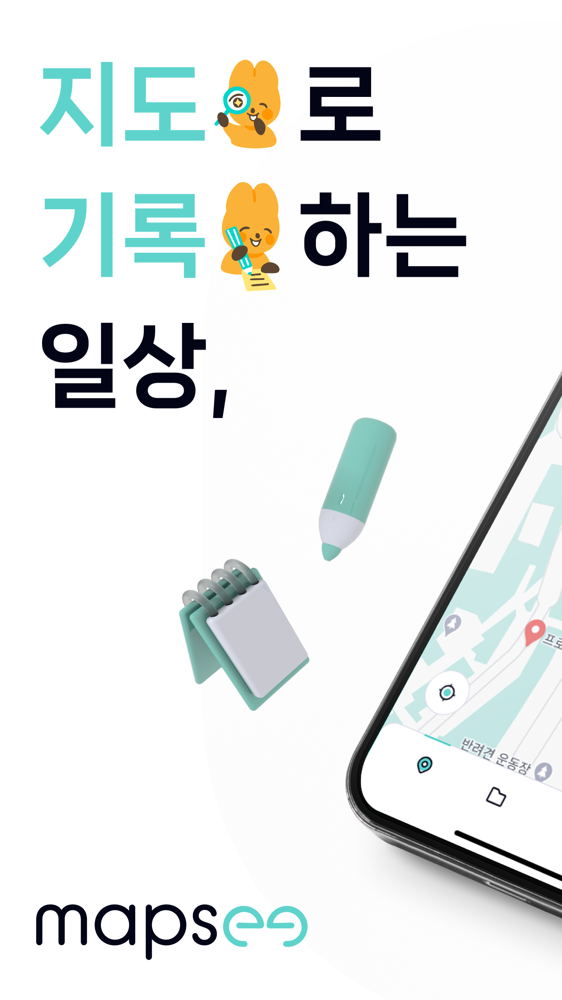
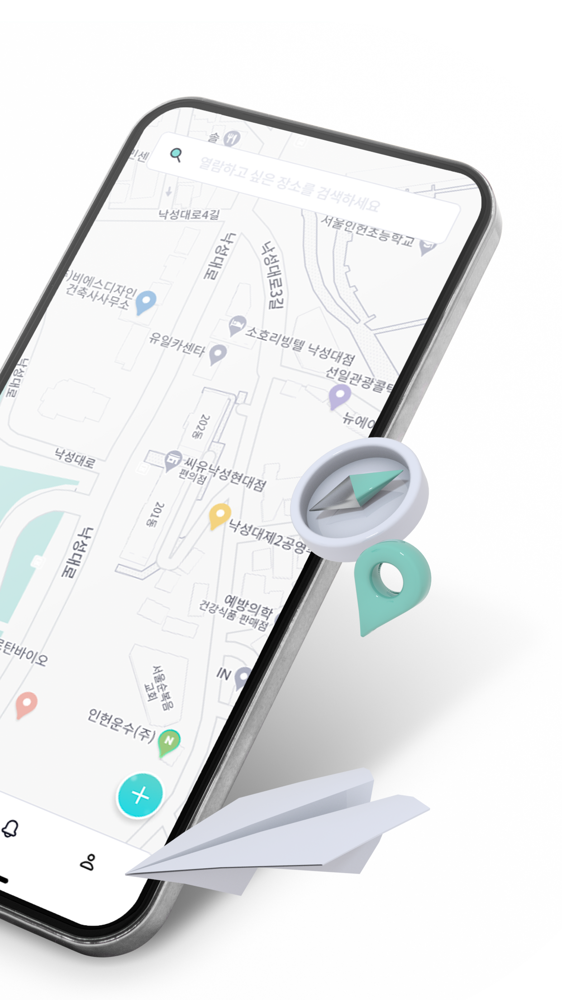
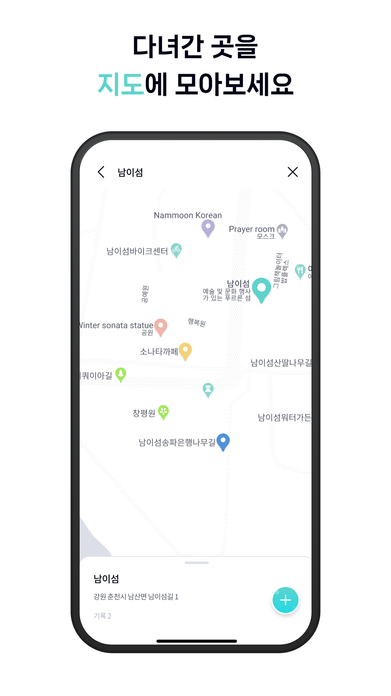
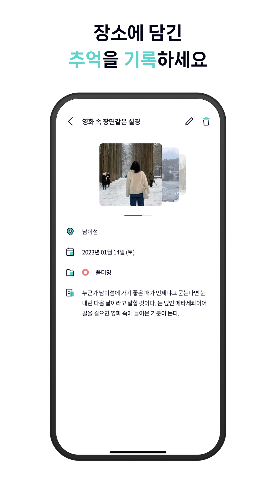
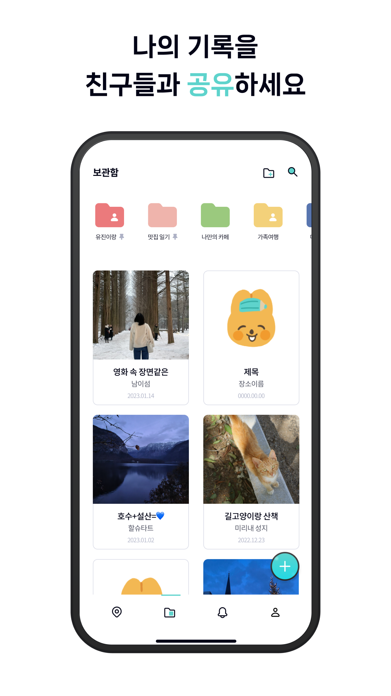

## What is this application?

Mapsee is a unique **map-based diary app** that allows you to record memories associated with specific locations, and share them with friends through collaborative folders. Mapsee brings a new dimension to journaling by tying your experiences directly to places on a map, letting you relive your memories and share meaningful places with others.

    
    
    
    
    

 

## Key Features

- **Write a Diary**  
  Choose a location on the map, jot down your day’s story, and add photos to capture the moment. With Mapsee, you can turn any place into a memory-filled entry in your own map-based journal.

- **Good Restaurants and Travel Destinations**  
  Collect and organize places that have significance to you, like favorite restaurants, travel spots, or hidden gems you discovered. All of these can be conveniently viewed and accessed on your personalized map, creating a curated collection of meaningful locations.

- **Shared Folders**  
  Create multiple folders to categorize your entries and invite friends to join. Shared folders allow you to collaboratively record memories and locations with others, making it perfect for group trips, family memories, or close friends who want to share their favorite spots.

 

## My role in Happetite

1. **Core Implementation**
- **Map and Search Functionalities**: Integrated Google Maps and Autocomplete APIs to enable proximity-based searches and intuitive map interactions, enhancing usability.
- **Diary Writing Section**: Developed a diary feature for users to record memories with location-based text entries, photos, and tags.

2. **Design and User Engagement**
- **Intuitive Interface**: Created interactive layouts with animations and tutorials, and designed a bottom sheet for seamless map-based search navigation.

3. **Data Management and Storage**
- **Optimized Storage**: Used async storage for recent searches and preferences, enabled image saving in diary entries, and maintained real-time data updates for accuracy.

4. **Apple App Review Submission**
- **App Store Compliance**: Ensured adherence to Apple guidelines, performed bug fixes, and communicated effectively with Apple’s review team for a smooth approval process.

 

## About Our Team - Happetite

Hello from **Happetite** [@mapsee_happetite](https://www.instagram.com/mapsee_happetite/)! We are an app development club from Seoul National University, driven by the goal of creating applications that bring happiness and convenience to people’s lives. Happetite is composed of students passionate about startups and tech innovation, with a mix of planners, developers, and designers.

**Our Story** \\
Happetite was founded to develop meaningful apps, and we currently work from the startup lounge, Spring Lounge. Our team structure is organized like a product unit, with a club founder, two planners, two developers, and one designer. Despite challenges such as leadership changes (e.g., due to military service), we successfully launched Mapsee by learning and collaborating as a team.

**About Mapsee** \\
Mapsee is our second product and our first map-based app service. With Mapsee, we wanted to create an app that goes beyond basic journaling, providing users with a way to document and share location-based memories in an engaging and interactive way.
