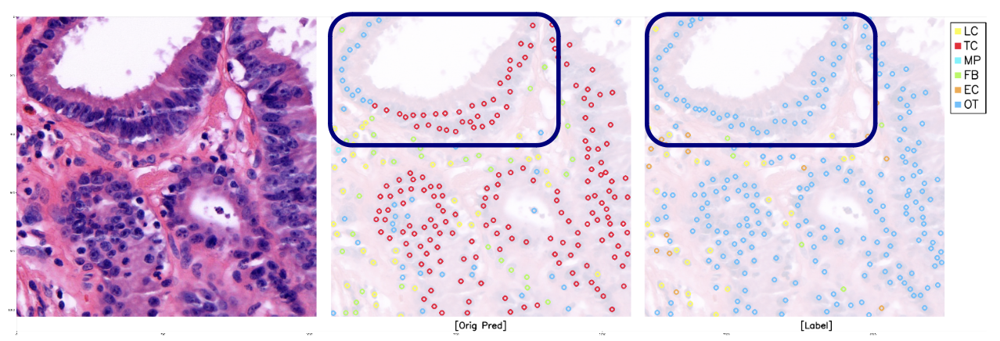
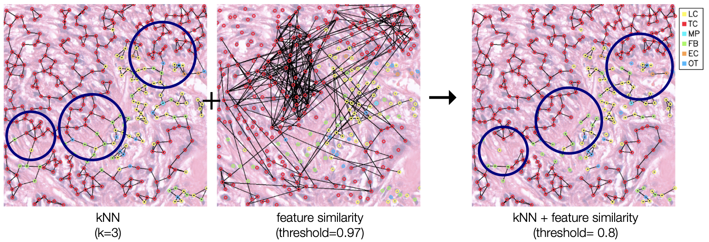
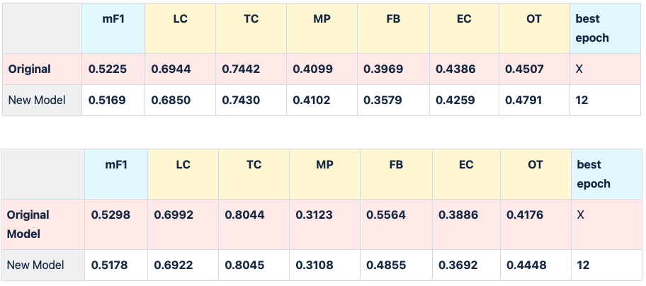
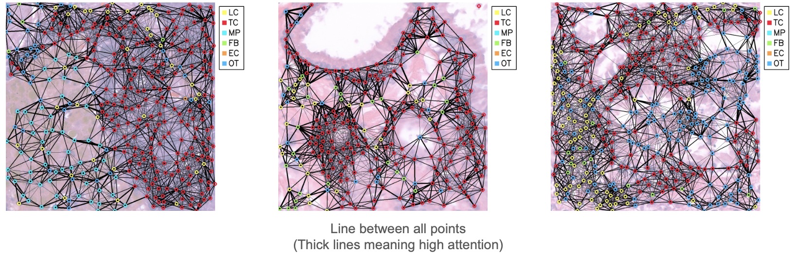

## Project Overview

**Project Goal**  
The goal of this project is to improve cell detection results by incorporating relationships between cells, beyond just detecting individual cells. By considering both positional information and feature similarity, the model more accurately represents cellular interactions.

**Define the Problem**  
The current model focuses on predicting each cell point individually, but it became clear that cell-to-cell relationships should be accounted for. This led to the development of the **Attention Based Cell Detection Enhancer**, which uses attention mechanisms to consider both positional and feature-based cell relationships.

 

## Idea Development

**Exploring Graphs**  
To represent the relationships between cells, we experimented with graphs created using **K-Nearest Neighbors (KNN)** and **Feature Maps**. This allowed us to visualize proximity-based connections and feature similarity, aiding in refining our model approach.

**Final Idea**  
The enhanced model combines positional data with feature similarity, providing a more comprehensive perspective on cellular interactions. This fusion is achieved through graph structures and attention layers within the model.

 

## Model Implementation & Architecture

**Define the Solution**  
The **Attention Based Cell Detection Enhancer** model is structured around attention mechanisms, specifically leveraging **Transformer architecture** to utilize both spatial and feature-based relationships among cells.

**Input Data**  
We use the original model's feature map and prediction results as inputs. By incorporating these, we can effectively link cells that are spatially and feature-wise close to one another.

**Model Architecture Development**  
Initially, we faced memory constraints, leading us to minimize the model's complexity. Our final architecture employs **Deformable Attention Layers** to efficiently manage GPU memory and accurately attend to relevant cell points.

 

## Experiment Results

**Experiment Comparison**  
We conducted experiments with various configurations (number of layers, optimizers, schedulers, etc.). The enhanced model shows improved accuracy over the original model, particularly in accurately classifying cell types and reducing false positives.

**Visualization Results**  
A visual comparison of the original and enhanced model results highlights the increase in accurate cell classification and the reduction of misclassified points.

 

## Attention Map

**Attention Map Analysis**  
The attention map generated by the model shows the strength of connections between cells, with lines indicating high-attention connections. Initially, only a few cells exhibited strong attention. By adding an **Attention Mask** that focuses on closer cells, we achieved more relevant interactions and improved model performance.

**Adding Attention Mask Based on Distance**  
To focus on biologically relevant interactions, we restricted attention to nearby cells. By masking out distant cells, the model could better highlight close interactions, leading to enhanced detection accuracy.

**Effect of Attention Map**  
With the Attention Mask, the model now more effectively highlights cell clusters, producing results that align closely with ground truth.

 

<!-- ## Further Investigation

**Future Directions**  
In the future, we aim to refine this model further by experimenting with alternative attention mechanisms and exploring ways to enhance scalability. Potential improvements include implementing adaptive attention based on biological insights and further optimizing the model for larger datasets. -->
