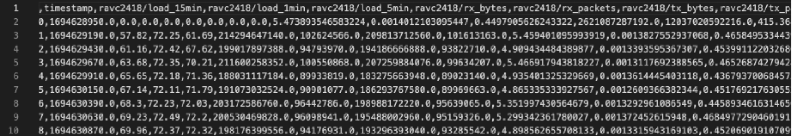
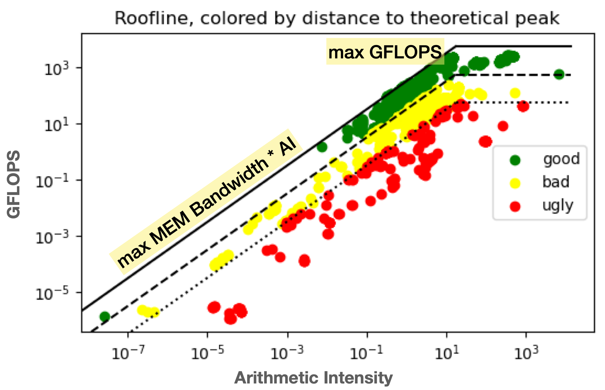
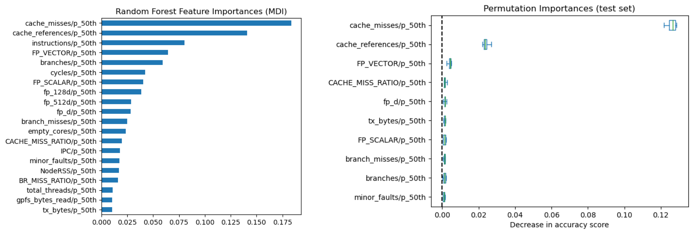
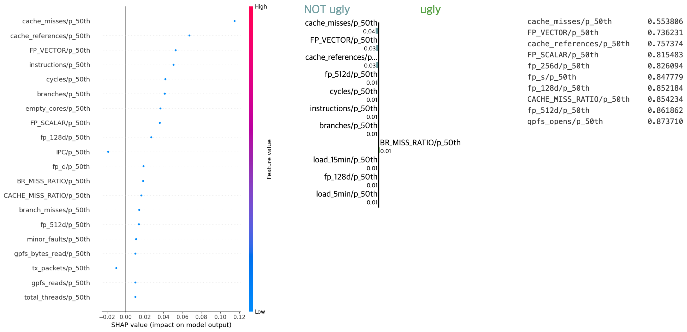

---

layout: individual_work
title: Leveraging Data Analytics for Improved Performance Monitoring on HPC Systems
slug: /research/leveraging-data-analytics-on-hpc-systems
permalink: /research/leveraging-data-analytics-on-hpc-systems/
date: Sep 2023 - Dec 2023
location: Max Planck Institute - Max Planck Computing and Data Facility
advisor: Dr. Klaus Reuter, Dr. Markus Rampp
---

A comprehensive study on performance data analysis, utilizing various machine learning techniques to understand and enhance system performance.

 

## Project Goal

The objective of this project is to help users optimize their resource usage on HPC (High-Performance Computing) systems. By analyzing performance data from the roofline model and using machine learning methods, we aimed to classify tasks as efficient or inefficient and provide recommendations.

- **Key Objectives**:
  - Improve resource utilization on HPC systems.
  - Understand which features contribute most to system performance.
  - Provide explainable insights into HPC job efficiency.

 

## Information about Data

**Data Overview**  
We collected performance metrics from HPC tasks, including CPU and GPU data, memory usage, and execution time. This data is pre-processed to remove noise and irrelevant information.

**Details**:
- Data fields: CPU, GPU metrics, memory usage, etc.
- Processed to ensure consistency and relevance for machine learning models.

**Image**: Screenshot of the data sample and description.

 

## Pre-processing Data

Data pre-processing involved cleaning, normalizing, and transforming the raw data for analysis. Some of the key steps included:

- **Scaling**: Normalized the data to bring all metrics to a similar scale.
- **Feature Engineering**: Extracted additional features from raw data to improve model performance.
- **Handling Missing Values**: Imputed or removed incomplete data points.

 

## Roofline Model

The roofline model was used to identify computational efficiency across tasks. This model provides a visual representation of performance, helping to distinguish efficient and inefficient tasks.

  

 

## Model Selection: Random Forest

After testing multiple methods, **Random Forest** was selected as the primary model due to its interpretability and strong performance with mixed data types.

- **Why Random Forest?**
  - Can handle a large number of features and interactions.
  - Provides feature importance scores, helping to understand what affects HPC efficiency.

 

## Feature Importance Analysis

Through Random Forest, we identified the most impactful features on system performance. Feature importance varied for CPU and GPU tasks, providing insights into the distinct requirements of each.

- **Top Features**:
  - CPU Usage
  - Memory Bandwidth
  - Execution Time

 

## Explainable AI techniques

To strengthen model robustness and interpretability, we employed several Explainable AI (XAI) techniques, including SHAP (Shapley Additive Explanations), LIME (Local Interpretable Model-Agnostic Explanations), and a custom random method. These techniques provided a comprehensive view of feature importance, enabling us to validate model behavior across different configurations.

**Explanation Methods**:

- SHAP: Used for calculating feature contributions on a global scale, offering consistent insights into model prediction influences.
- LIME: Provided local interpretability by creating surrogate models for specific instances, ensuring stability on individual samples.
- Custom Random Method: Served as a baseline, with randomly permuted features helping distinguish significant features from noise.

    <strong>Figure Explanation:</strong> 
    <em>Left:</em> SHAP values display feature importance, highlighting the impact of each feature on model output.  
    <em>Center:</em> LIME values show instance-specific insights for local interpretability.   
    <em>Right:</em> Random method results serve as a baseline for feature significance comparison.

 

## Conclusion

The analysis provided valuable insights into the factors affecting HPC job performance, allowing users to better allocate resources and improve efficiency. We achieved high model accuracy and identified key features contributing to HPC performance.

<!-- 

## **Further Directions**

Future work includes:
- Exploring other machine learning models to improve prediction accuracy.
- Implementing adaptive models for different types of HPC jobs.
- Enhancing interpretability with Explainable AI methods to support non-expert users. -->
